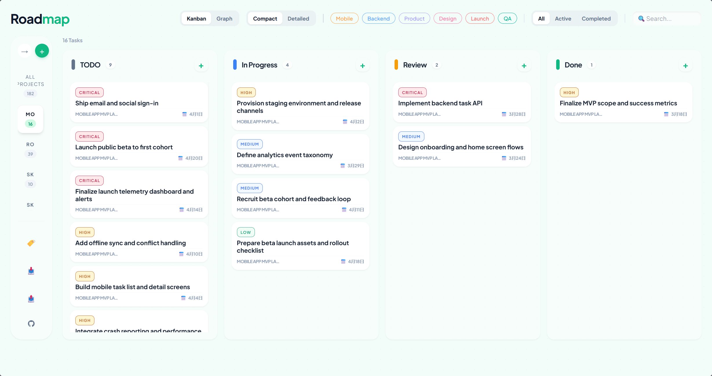

# Roadmap Skill

<p align="center">
  
</p>

<p align="center">
  <strong>Let AI manage your projects, keep Kanban simple</strong><br>
  Zero-config startup, local data, Agent-native support
</p>

<p align="center">
  <a href="README.zh.md">简体中文</a> | English
</p>

<p align="center">
  <a href="https://www.npmjs.com/package/roadmap-skill"></a>
  <a href="https://github.com/shiquda/roadmap-skill/blob/main/LICENSE"></a>
  <a href="https://www.npmjs.com/package/roadmap-skill"></a>
</p>

<p align="center">
  <a href="https://insiders.vscode.dev/redirect/mcp/install?name=roadmap&config=%7B%22command%22%3A%22npx%22%2C%22args%22%3A%5B%22-y%22%2C%22roadmap-skill%22%5D%7D"></a>
  <a href="https://insiders.vscode.dev/redirect/mcp/install?name=roadmap&config=%7B%22command%22%3A%22npx%22%2C%22args%22%3A%5B%22-y%22%2C%22roadmap-skill%22%5D%7D&quality=insiders"></a>
</p>

---

## Why Roadmap Skill?

| Your Pain Point | How Roadmap Skill Solves It |
|----------------|----------------------------|
| Project data scattered in third-party clouds | **Local-first** — All data stored on your machine, full control, works offline |
| Copy-pasting task lists when chatting with AI | **Agent-native** — AI reads/writes tasks directly, zero friction in conversation |
| Text-only management lacks visuals, but traditional tools are bloated | **Beautiful Kanban** — Open browser when needed, drag and drop, doesn't interrupt coding flow |
| Ideas and bugs from Vibe Coding get forgotten | **Collection Box** — Let Agent capture scattered thoughts, auto-organize todos |
| Too many tasks, don't know where to start | **Smart Recommendations** — Agent analyzes context, proactively suggests next steps |

---

## Quick Start (Zero Config)

```bash
# Option 1: Launch Web Kanban
npx roadmap-skill-web

# Option 2: Integrate with your AI assistant (MCP config below)
```

<details>
<summary><b>View platform configurations</b></summary>

<details>
<summary><b>Claude Code</b></summary>

```bash
claude mcp add roadmap "npx -y roadmap-skill"
```

</details>

<details>
<summary><b>Claude Desktop</b></summary>

```json
{
  "mcpServers": {
    "roadmap": {
      "command": "npx",
      "args": ["-y", "roadmap-skill"]
    }
  }
}
```

</details>

<details>
<summary><b>Copilot</b></summary>

```bash
/mcp add
```

Or edit `~/.copilot/mcp-config.json`:

```json
{
  "mcpServers": {
    "roadmap": {
      "type": "local",
      "command": "npx",
      "args": ["-y", "roadmap-skill"]
    }
  }
}
```

</details>

<details>
<summary><b>Cursor</b></summary>

```json
{
  "mcpServers": {
    "roadmap": {
      "command": "npx",
      "args": ["-y", "roadmap-skill"]
    }
  }
}
```

</details>

<details>
<summary><b>JetBrains (via Cline)</b></summary>

Install Cline plugin, then add to `cline_mcp_settings.json`:

```json
{
  "mcpServers": {
    "roadmap": {
      "type": "stdio",
      "command": "npx",
      "args": ["-y", "roadmap-skill"]
    }
  }
}
```

</details>

<details>
<summary><b>Roo Code</b></summary>

```json
{
  "mcpServers": {
    "roadmap": {
      "type": "stdio",
      "command": "npx",
      "args": ["-y", "roadmap-skill"]
    }
  }
}
```

</details>

<details>
<summary><b>Opencode</b></summary>

Edit `~/.config/opencode/opencode.json`:

```json
{
  "$schema": "https://opencode.ai/config.json",
  "mcp": {
    "roadmap": {
      "type": "local",
      "command": [
        "npx",
        "-y",
        "roadmap-skill"
      ],
      "enabled": true
    }
  }
}
```

</details>

<details>
<summary><b>Trae</b></summary>

Go to `Settings` -> `MCP` -> `Add new MCP Server`:

```json
{
  "mcpServers": {
    "roadmap": {
      "command": "npx",
      "args": ["-y", "roadmap-skill"]
    }
  }
}
```

</details>

<details>
<summary><b>VS Code</b></summary>

```json
{
  "mcp": {
    "servers": {
      "roadmap": {
        "command": "npx",
        "args": ["-y", "roadmap-skill"]
      }
    }
  }
}
```

</details>

<details>
<summary><b>Windsurf</b></summary>

Follow Windsurf MCP documentation and use:

```json
{
  "mcpServers": {
    "roadmap": {
      "command": "npx",
      "args": ["-y", "roadmap-skill"]
    }
  }
}
```

</details>

<details>
<summary><b>Zed</b></summary>

```json
{
  "context_servers": {
    "roadmap": {
      "command": {
        "path": "npx",
        "args": ["-y", "roadmap-skill"]
      }
    }
  }
}
```

</details>

</details>

<br>

After setup, simply tell your AI:

> "Create a website redesign project with tasks for homepage, about page, and contact form"

The AI will immediately create the project and tasks, saving them to local storage. You can open <http://localhost:7860> anytime to view the visual Kanban board.

---

## Who Is This For?

| Scenario | What Roadmap Skill Does For You |
|---------|--------------------------------|
| **Solo Developers** | Manage personal projects through conversation, avoid getting lost in complex tools |
| **AI Power Users** | Let Agent directly read/write tasks, goodbye to copy-pasting hassle |
| **Vibe Coders** | Capture inspirations on the fly, automatically save to collection box |
| **Small Teams** | Simple task assignment and progress tracking, zero learning curve |
| **Privacy-conscious Users** | Data stored completely locally, never uploaded to any cloud service |

---

## Typical Use Cases

### 1. Capture Inspiration During Vibe Coding

When discussing new features with AI, suddenly think of an optimization:

> "Add this to my collection: Refactor user auth module using JWT + Refresh Token scheme"

AI automatically creates the task, and you'll see it in the Kanban later.

### 2. Let AI Plan Project Structure

Starting a new project? Just ask AI to break it down:

> "Create an e-commerce admin dashboard project with product management, order processing, and user permissions modules, broken down into specific development tasks"

AI auto-creates the project structure. Just open the Kanban in browser and drag tasks to start working.

### 3. Progress Tracking and Status Updates

Check progress anytime during coding:

> "What's the completion percentage of my current project? What high-priority tasks haven't started yet?"

> "Mark the user login feature as completed and create corresponding test tasks"

### 4. Team Collaboration and Assignment

Quickly assign in conversation:

> "Assign frontend page tasks to @zhangsan, deadline this Friday, priority high"

Team members can view their task list in the Kanban.

---

## Installation

### Requirements

- Node.js 18+ (recommended 20+)

### Global Install

```bash
npm install -g roadmap-skill
```

### Use Without Installing

```bash
npx roadmap-skill-web      # Web Kanban only
npx roadmap-skill          # Full MCP server
```

---

## Core Features

| Feature | Description |
|--------|-------------|
| **Kanban View** | Four columns: Todo, In Progress, Review, Done |
| **Drag and Drop** | Drag tasks to update status, WYSIWYG |
| **Quick Create** | Click "+" button on any column to instantly add tasks |
| **Dual View** | Compact mode for overview, detailed mode for full info |
| **Smart Search** | Quick task search across all projects, keyword filtering |

---

## Supported Platforms

- ✅ **Claude Code** — Command-line AI assistant
- ✅ **Claude Desktop** — Full MCP integration
- ✅ **Cursor** — AI-powered IDE
- ✅ **VS Code** — Via Cline or Roo Code extensions
- ✅ **Any MCP Client** — Standard MCP protocol support

---

## Data Storage

Roadmap Skill uses **pure local JSON file storage**. All data is saved in your user directory:

| Platform | Storage Path |
|---------|-------------|
| macOS | `~/.roadmap-skill/data/` |
| Linux | `~/.roadmap-skill/data/` |
| Windows | `%USERPROFILE%\.roadmap-skill\data\` |

### Data File Structure

```
.roadmap-skill/
└── data/
    ├── projects.json      # Project list
    ├── tasks.json         # All tasks
    └── tags.json          # Tag definitions
```

- ✅ **Fully offline** — No internet connection needed
- ✅ **Portable** — Copy folder to backup/transfer
- ✅ **Version control friendly** — JSON format for easy diff
- ✅ **Privacy secure** — Data never leaves your machine

---

## License

MIT © [shiquda](https://github.com/shiquda)

---

<p align="center">
  <strong>If this project helps you, please consider giving it a star!</strong>
</p>
