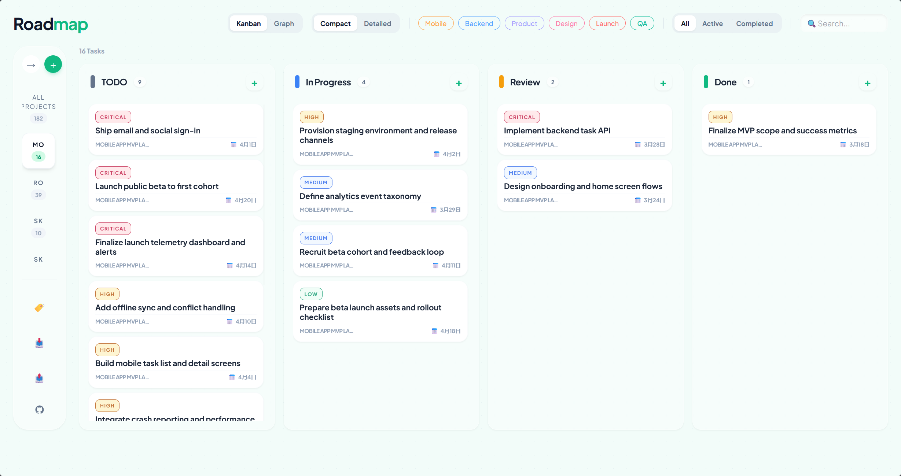
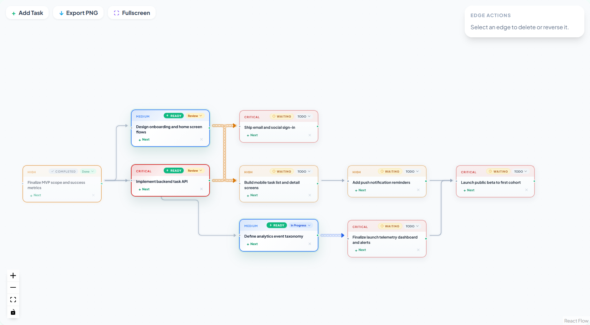

# Roadmap Skill

<p align="center">
  
</p>

<p align="center">
  <sub>The local planning workspace: status in Kanban, execution order in Graph View.</sub>
</p>

<p align="center">
  <strong>Shared roadmap for humans and AI Agents</strong><br>
  Visual kanban and graph views for you. MCP server for Agents. Local-first.
</p>

<p align="center">
  <a href="README.zh.md">简体中文</a> | English
</p>

<p align="center">
  <a href="https://www.npmjs.com/package/roadmap-skill"></a>
  <a href="https://github.com/shiquda/roadmap-skill/blob/main/LICENSE"></a>
  <a href="https://www.npmjs.com/package/roadmap-skill"></a>
</p>

<p align="center">
  <a href="https://insiders.vscode.dev/redirect/mcp/install?name=roadmap&config=%7B%22command%22%3A%22npx%22%2C%22args%22%3A%5B%22-y%22%2C%22roadmap-skill%22%5D%7D"></a>
  <a href="https://insiders.vscode.dev/redirect/mcp/install?name=roadmap&config=%7B%22command%22%3A%22npx%22%2C%22args%22%3A%5B%22-y%22%2C%22roadmap-skill%22%5D%7D&quality=insiders"></a>
</p>

---

## What Makes It Different

**Shared context** — Chat with your Agent to plan tasks, or edit directly in the Kanban — both stay in sync. Your Agent always sees the latest state.

**Agent-native** — Built as an MCP server. Your AI can create, update, and query tasks directly in conversation.

**Visual workspace** — Open `localhost:7860` when you feel like it, or ask your Agent to open it with `open_web_interface`. Kanban for status, Graph View for sequencing. Or just stay in chat. All three work.

**Local-first** — Your data lives on your machine. No accounts, no cloud sync, no vendor lock-in.

---

## New in v0.3.0: Graph View

Graph View is one of the headline features in `v0.3.0`.

<p align="center">
  
</p>

<p align="center">
  <sub>Graph View turns roadmap tasks into a dependency map, so you can inspect order, blockers, and ready work at a glance.</sub>
</p>

Kanban is great for tracking status. Graph View is for understanding execution order.

It helps you and your Agent answer questions like:

- What has to happen first?
- Which tasks are ready right now?
- What is blocked by unfinished work?
- Which dependency should be added, reversed, or removed?

Instead of treating roadmap tasks as a flat list, Graph View turns them into a visual dependency map with node connections, ready/done states, detailed task cards, and export support. It is designed for planning sessions where sequencing matters just as much as status.

If you are using Roadmap Skill as an MCP workspace, this is the view that makes agent-assisted planning feel concrete: your Agent can build and update dependency graphs in chat, and you can immediately inspect the structure visually in the web UI.

---

## Quick Start (Zero Config)

```bash
# Integrate with your AI assistant (MCP config below)
```

<details>
<summary><b>View platform configurations</b></summary>

<details>
<summary><b>Claude Code</b></summary>

```bash
claude mcp add roadmap "npx -y roadmap-skill"
```

</details>

<details>
<summary><b>Claude Desktop</b></summary>

```json
{
  "mcpServers": {
    "roadmap": {
      "command": "npx",
      "args": ["-y", "roadmap-skill"]
    }
  }
}
```

</details>

<details>
<summary><b>Copilot</b></summary>

```bash
/mcp add
```

Or edit `~/.copilot/mcp-config.json`:

```json
{
  "mcpServers": {
    "roadmap": {
      "type": "local",
      "command": "npx",
      "args": ["-y", "roadmap-skill"]
    }
  }
}
```

</details>

<details>
<summary><b>Cursor</b></summary>

```json
{
  "mcpServers": {
    "roadmap": {
      "command": "npx",
      "args": ["-y", "roadmap-skill"]
    }
  }
}
```

</details>

<details>
<summary><b>JetBrains (via Cline)</b></summary>

Install Cline plugin, then add to `cline_mcp_settings.json`:

```json
{
  "mcpServers": {
    "roadmap": {
      "type": "stdio",
      "command": "npx",
      "args": ["-y", "roadmap-skill"]
    }
  }
}
```

</details>

<details>
<summary><b>Roo Code</b></summary>

```json
{
  "mcpServers": {
    "roadmap": {
      "type": "stdio",
      "command": "npx",
      "args": ["-y", "roadmap-skill"]
    }
  }
}
```

</details>

<details>
<summary><b>Opencode</b></summary>

Edit `~/.config/opencode/opencode.json`:

```json
{
  "$schema": "https://opencode.ai/config.json",
  "mcp": {
    "roadmap": {
      "type": "local",
      "command": [
        "npx",
        "-y",
        "roadmap-skill"
      ],
      "enabled": true
    }
  }
}
```

</details>

<details>
<summary><b>Trae</b></summary>

Go to `Settings` -> `MCP` -> `Add new MCP Server`:

```json
{
  "mcpServers": {
    "roadmap": {
      "command": "npx",
      "args": ["-y", "roadmap-skill"]
    }
  }
}
```

</details>

<details>
<summary><b>VS Code</b></summary>

```json
{
  "mcp": {
    "servers": {
      "roadmap": {
        "command": "npx",
        "args": ["-y", "roadmap-skill"]
      }
    }
  }
}
```

</details>

<details>
<summary><b>Windsurf</b></summary>

Follow Windsurf MCP documentation and use:

```json
{
  "mcpServers": {
    "roadmap": {
      "command": "npx",
      "args": ["-y", "roadmap-skill"]
    }
  }
}
```

</details>

<details>
<summary><b>Zed</b></summary>

```json
{
  "context_servers": {
    "roadmap": {
      "command": {
        "path": "npx",
        "args": ["-y", "roadmap-skill"]
      }
    }
  }
}
```

</details>

<details>
<summary><b>Codex CLI / Codex IDE</b></summary>

**One-liner (recommended):**

```bash
codex mcp add roadmap -- npx -y roadmap-skill
```

**Manual config** — edit `~/.codex/config.toml`:

```toml
[mcp_servers.roadmap]
command = "npx"
args = ["-y", "roadmap-skill"]
```

> **Windows**: No `cmd /c` wrapper needed — Codex handles the subprocess directly.

> **Server name**: Must match `^[a-zA-Z0-9_-]+$`. Names with spaces or parentheses are rejected.

> **Note**: Both Codex CLI and the Codex VSCode extension share the same `~/.codex/config.toml`. A syntax error breaks both.

</details>

</details>

<br>

After setup, simply tell your AI:

> "Create a website redesign project with tasks for homepage, about page, and contact form"

The AI will immediately create the project and tasks, saving them to local storage. You can open <http://localhost:7860> anytime to view the visual Kanban board.

---

## Agent Skills

This repository includes installable skills under `skills/`, distributed through the git repository rather than the published npm package.

Available skills:

- `skills/roadmap/` - lightweight background and routing for roadmap-skill
- `skills/roadmap-task-flow/` - capture, enrich, tag, and prioritize roadmap tasks
- `skills/roadmap-planning-views/` - build focused planning graphs from task subsets
- `skills/roadmap-web-visualization/` - open and use the local roadmap web workspace

Recommended installation pattern for skill-aware tools:

```bash
# install from the git repository when the installer supports repo sources
npx skills add shiquda/roadmap-skill
```

These skills are still in beta. If you run into issues or have suggestions, feedback is very welcome.

---

## Who Is This For?

Solo developers, AI power users, and vibe coders who want their Agent to be a real collaborator — not just a code generator.

---

## Typical Use Cases

### 1. Capture Ideas Without Breaking Flow

Mid-session, something pops into your head:

> "Note this down: switch the auth module to JWT + refresh token rotation"

Use `/quick-capture` or just say "help me note this down" — your Agent turns it into a task, saves it locally, and you keep going. No context switch, no forgotten ideas.

### 2. Let Agent Help You Prioritize

> "This month's OKR is finishing the user system refactor — can you list the related tasks and figure out which ones should come first?"

Use `/auto-prioritize` to let your Agent analyze the current project state and reorder task priorities accordingly.

### 3. Let Agent Recommend What to Do Next

> "What's left on the current project? Any high-priority tasks I haven't touched yet?"

Or use `/suggest-tasks` — your Agent recommends the next actions based on current progress and priorities.

No tab switching. No copy-pasting. Just ask
---

## Core Features

| Feature | Description |
|--------|-------------|
| **Kanban View** | Four columns: Todo, In Progress, Review, Done |
| **Graph View** | Visual dependency map for sequencing work, spotting blockers, and reviewing execution order |
| **Ready / Blocked Signals** | Quickly see which tasks are ready now and which ones still depend on unfinished work |
| **Dependency Editing** | Add, reverse, and remove task dependencies directly from the planning graph |
| **Graph Export** | Export dependency graphs as images for sharing, review, or release planning |
| **Drag and Drop** | Drag tasks to update status, WYSIWYG |
| **Quick Create** | Click "+" button on any column to instantly add tasks |
| **Dual View** | Compact mode for overview, detailed mode for full info |
| **Smart Search** | Quick task search across all projects, keyword filtering |

---

## Supported Platforms

- ✅ **Claude Code, Codex, OpenCode** — Command-line AI assistants
- ✅ **Cursor, VS Code** — AI-powered IDEs
- ✅ **Any MCP Client** — Standard MCP protocol support

---

## Data Storage

Roadmap Skill uses **pure local JSON file storage**. All data is saved in your user directory:

| Platform | Storage Path |
|---------|-------------|
| Windows | `%USERPROFILE%\.roadmap-skill` |
| macOS | `~/.roadmap-skill/` |
| Linux | `~/.roadmap-skill/` |

You can export or import backup files from the web interface.

---

## License

MIT © [shiquda](https://github.com/shiquda)

---

<p align="center">
  <strong>If this project helps you, please consider giving it a star!</strong>
</p>
